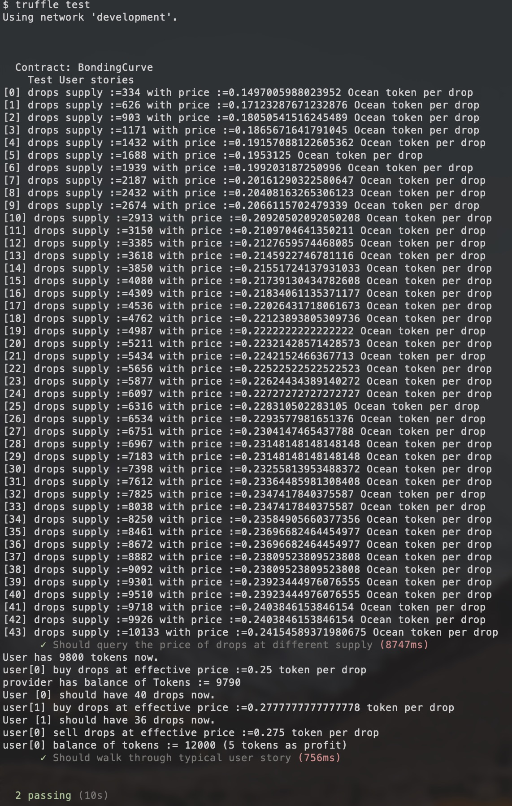

[](https://oceanprotocol.com)

[](https://github.com/oceanprotocol/eslint-config-oceanprotocol)

---

## Table of Contents

  - [Specifications](#specifications)
  - [Development](#development)
     - [Contract testing](#contract-testing)
  - [License](#license)

---

## Specifications

1. the account that deployes the contract is the `token contract owner`;
1. `contract owner` has all the tokens at the begining;
1. user can request tokens from bonding curve contract;
1. user can buy drops (i.e., bonded tokens) using their ERC20 tokens;
1. user can sell drops back into the bonding curve and get ERC20 tokens back;
1. user can withdraw their ERC20 tokens back into their own wallets.

## Development

- First, install project dependencies:

```bash
npm install 
```

- On a separate terminal window, start an instance of ganache:

```
ganache-cli
```

- To migrate/deploy the contracts on the local development network:

```
truffle migrate
```

### Contract testing

- The token contract can be tested with `test/TestToken.js` file:

```bash
npm test
```

The result is similar to following:



## License

```
Copyright 2018 Ocean Protocol Foundation Ltd.

Licensed under the Apache License, Version 2.0 (the "License");
you may not use this file except in compliance with the License.
You may obtain a copy of the License at

   http://www.apache.org/licenses/LICENSE-2.0

Unless required by applicable law or agreed to in writing, software
distributed under the License is distributed on an "AS IS" BASIS,
WITHOUT WARRANTIES OR CONDITIONS OF ANY KIND, either express or implied.
See the License for the specific language governing permissions and
limitations under the License.
```
